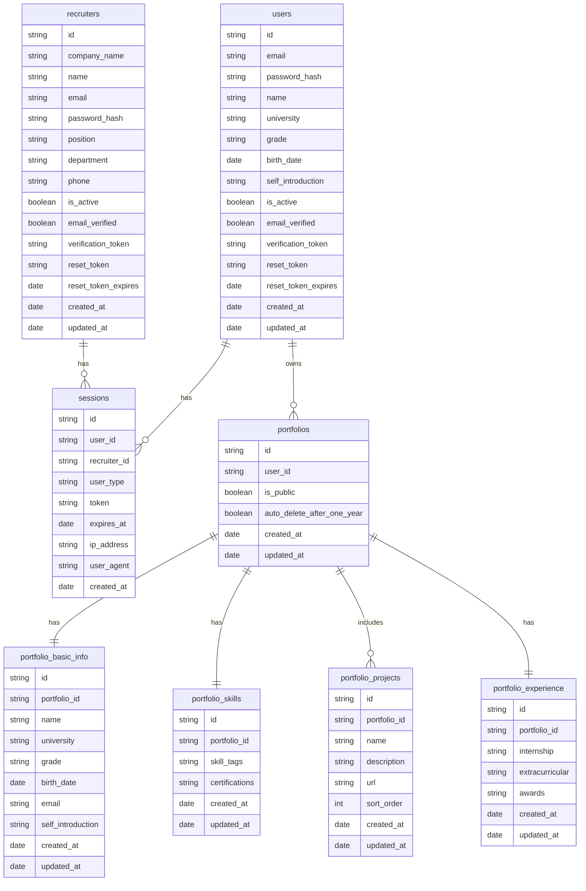

```mermaid
erDiagram
    users ||--o{ sessions : has
    recruiters ||--o{ sessions : has
    users ||--o{ portfolios : owns
    portfolios ||--|| portfolio_basic_info : has
    portfolios ||--|| portfolio_skills : has
    portfolios ||--o{ portfolio_projects : includes
    portfolios ||--|| portfolio_experience : has

    users {
        string id
        string email
        string password_hash
        string name
        string university
        string grade
        date birth_date
        string self_introduction
        boolean is_active
        boolean email_verified
        string verification_token
        string reset_token
        date reset_token_expires
        date created_at
        date updated_at
    }

    recruiters {
        string id
        string company_name
        string name
        string email
        string password_hash
        string position
        string department
        string phone
        boolean is_active
        boolean email_verified
        string verification_token
        string reset_token
        date reset_token_expires
        date created_at
        date updated_at
    }

    sessions {
        string id
        string user_id
        string recruiter_id
        string user_type
        string token
        date expires_at
        string ip_address
        string user_agent
        date created_at
    }

    portfolios {
        string id
        string user_id
        boolean is_public
        boolean auto_delete_after_one_year
        date created_at
        date updated_at
    }

    portfolio_basic_info {
        string id
        string portfolio_id
        string name
        string university
        string grade
        date birth_date
        string email
        string self_introduction
        date created_at
        date updated_at
    }

    portfolio_skills {
        string id
        string portfolio_id
        string skill_tags
        string certifications
        date created_at
        date updated_at
    }

    portfolio_projects {
        string id
        string portfolio_id
        string name
        string description
        string url
        int sort_order
        date created_at
        date updated_at
    }

    portfolio_experience {
        string id
        string portfolio_id
        string internship
        string extracurricular
        string awards
        date created_at
        date updated_at
    }
```